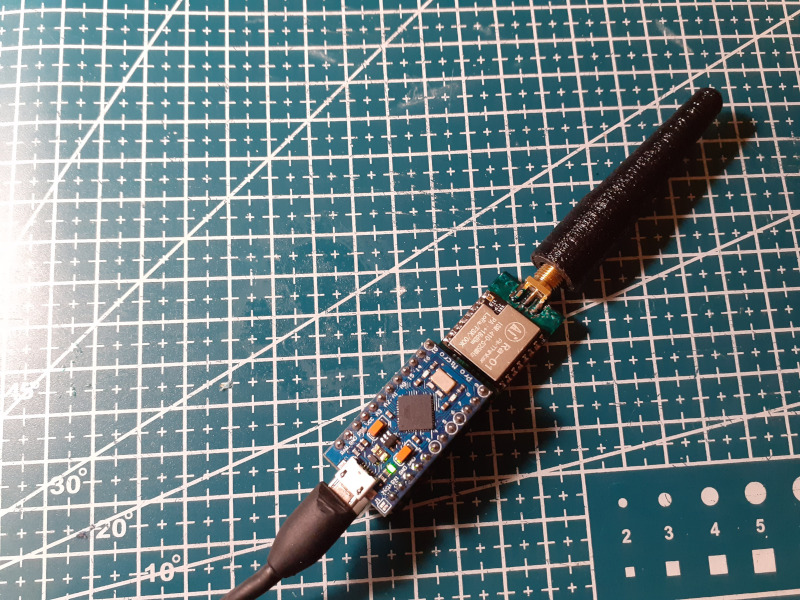

# Arduino Micro LoRA KISS modem and APRS AX.25 digirepeater

This project is standalone Arduino Micro LoRA USB KISS modem and APRS AX.25 digirepeater with RA-01 LoRA module.

Can be build in two modes:
- As USB KISS modem, to be used with Linux AX.25 tools over USB or with APRSDroid or Codec2Talkie applications
- As a standalone AX.25 digirepeater

