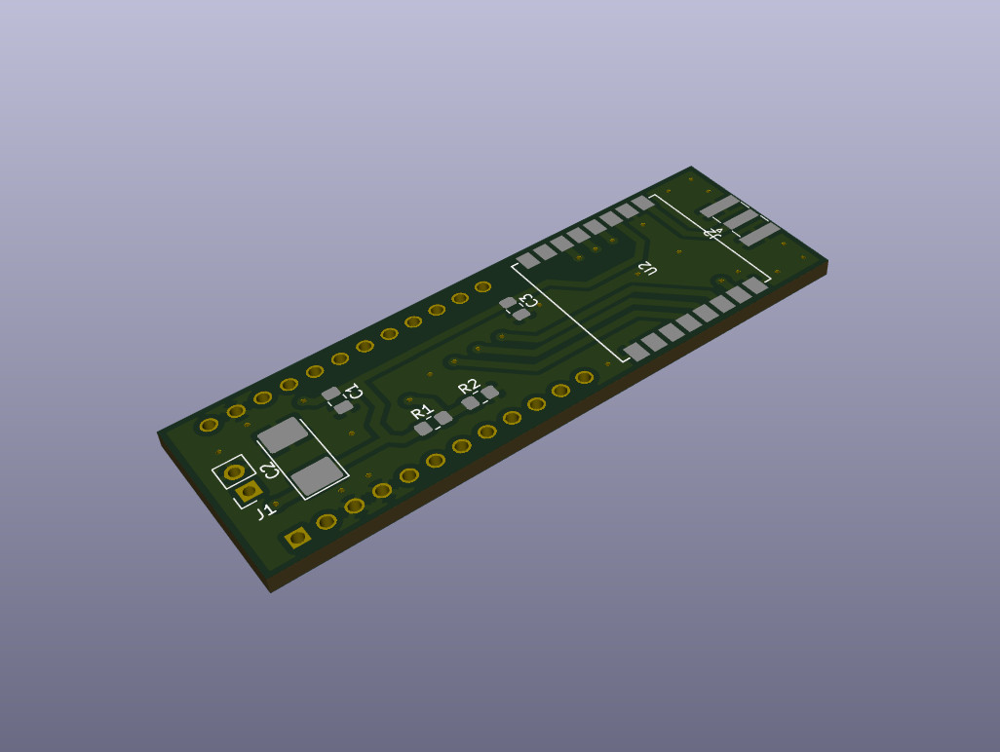

# Arduino Micro LoRA KISS modem and APRS AX.25 digirepeater

## Introduction
This project is a standalone Arduino Micro LoRA USB KISS modem and APRS AX.25 digirepeater with RA-01 LoRA module. Probably, could be easily used with other Arduino boards.

Can be build in two modes:
- As USB KISS modem, to be used with Linux AX.25 tools over USB or with APRSDroid or Codec2Talkie applications over USB OTG
- As a standalone AX.25 digirepeater

## Configuration
Update `include/config.h` with your LoRA modulation settings and module pinouts.

## Buildings
Use platformio to build required configuration for repeater or modem.

## Photos

